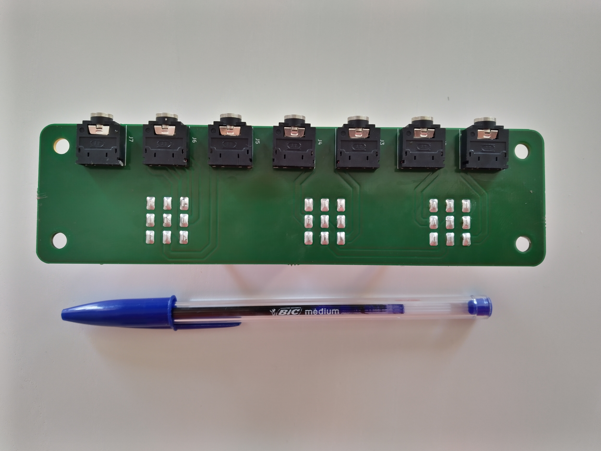

# Audio multiplexer


## Description

A simple passive multiplexer providing :
* two 3.5mm jack inputs connected to two PC line outputs,
* two 3.5mm jack outputs connected to active speakers and a headset,
* one 3.5mm jack input connected to the headset microphone,
* two 3.5mm jack outputs connected to two PC microphone inputs.

```
                      +------+
             Line out |      | Mic in
     +----------------| PC 1 |<---------------+
     |                |      |                |
     |                +------+                |
     |                                        |
     |                +------+                |
     |       Line out |      | Mic in         |
     |   +------------| PC 2 |<-----------+   |
     |   |            |      |            |   |
     |   |            +------+            |   |
     |   |                                |   |
     v   v                                |   |
  +----------------------------------------------+             
  |              AUDIO MULTIPLEXER               |
  |                                              |
  |  Audio             Audio                Mic  |
  |   in                out                 in   |
  |                                              |
  +----------------------------------------------+
                       |  |                  ^
                       |  |                  |
                +------+  +-----+   +--------+
                |               |   |
                v               v   |
           +----------+      +---------+
           |          |      | Headset |
           | Speakers |      |  with   |
           |          |      |  mic    |
           +----------+      +---------+
```

The multiplexer microphone input is designed to be driven separately in case this is needed later.

## PCB

The PCB has been designed with KiCad 6.0.6.

Naked PCB :


Assembled PCB :



## Casing

The casing has been designed with FreeCAD 0.19. The multiple DXF files generated by FreeCAD have been combined using LibreCAD 2.1.3.
The casing has been designed to be laser-cut in a 4-mm thick 304 stainless steel.

Steel plates :


Casing top :


Casing bottom :


Casing front :


Casing rear :


Casing front angled :


Casing rear angled :

